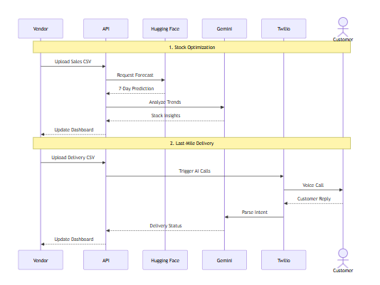

# 🧠 Pulse: Intelligent Operations for Dark Stores & Retail Supply Chains

**Event:** Google Solution Challenge 2026  
**Team Name:** DSA  

---

## 📚 Table of Contents
- [🚀 Project Overview](#-project-overview)
- [🏆 Problem Statement](#-problem-statement)
- [🏗️ Architecture & Process Flows](#️-architecture--process-flows)
- [💡 What Does Pulse Do?](#-what-does-pulse-do)
- [📈 Business Value & Cost](#-business-value--cost)
- [📦 Features](#-features)
- [🛠️ Tech Stack](#️-tech-stack)
- [⚙️ How It Works](#-how-it-works)
- [🔭 Future Development Roadmap](#-future-development-roadmap)
- [👥 Team & Credits](#-team--credits)

---

## 🚀 Project Overview
**Pulse** is an end-to-end AI solution designed for high-speed dark store environments where demand is volatile and delivery timelines are tight. It integrates smart inventory prediction with automated last-mile delivery communication to reduce wastage and manual workload.

Built for scale and real-world usability, Pulse uses **Hugging Face** for demand forecasting, **Gemini API** for intelligent insights, and **Twilio** for automated telephony.

---

## 🏆 Problem Statement
**Focus Track:** Smart Supply Chains Open Innovation

Retailers and dark stores face critical challenges:
- **Overstocking:** Wastage of perishable goods due to inaccurate planning  
- **Understocking:** Lost sales and poor customer experience  
- **Failed Deliveries:** Lack of proactive communication  
- **Manual Effort:** High operational overhead  

---

## 🏗️ Architecture & Process Flows

### 1. Technical Sequence Architecture


### 2. Core Process Flows
Pulse automates two primary pipelines: Stock Optimization and Last-Mile Delivery.


## 💡 What Does Pulse Do?

### 📊 Intelligent Stock Optimization

* Forecasts SKU-level demand using historical data
* Reduces stockouts and wastage
* Enables data-driven inventory planning


### 📞 Automated Delivery Coordination & WhatsApp Updates

* **Automated Voice Calls:** AI-powered voice calls to customers to confirm availability and delivery instructions.
* **WhatsApp Notification Engine:** Send WhatsApp updates to customers and track their real-time responses.
* **Unified Control:** Centralized triggers for both phone calls and WhatsApp requests.


### 🤖 Response Capture & Feedback Integration

* Converts customer voice responses into structured data and logs driver instructions.
* Captures real-time WhatsApp replies directly within the vendor's dashboard.
* Smart retry system to quickly handle failed delivery updates.


### 🔐 Secure Authentication & Google OAuth

* Simple, secure vendor and delivery partner onboarding.
* Traditional email/password accounts secured via JWT.
* Seamless Google OAuth integration for quick access.


---

## 📦 Features

- 📊 **AI Demand Forecasting**
- 📞 **Voice bot integration** via Twilio.
- 🧠 **Gemini-powered insights** — trends, anomalies, recommendations.
- 🔌 **WebSocket** real-time dashboard updates.
- 🛠️ **REST APIs** via Render backend.
- 📊 **Intuitive dashboards** for vendors and delivery partners.
- 🔐 **Secure authentication** with JWT + Google OAuth.
- 💻 **Responsive, modern frontend** using React + Tailwind.
- 🔁 **Smart Retry Logic** for failed deliveries.

---

## 📈 Business Value & Cost

### Impact

* Higher delivery success rates
* Reduced stock wastage
* Lower operational workload

### Scalability

* Works with simple CSV uploads
* Suitable for multi-store operations

### Monthly Cost Estimate (1,000 Users)

| Component     | Technology                | Cost              |
| ------------- | ------------------------- | ----------------- |
| Communication | Twilio                    | ₹1,000 - ₹2,000   |
| AI Processing | Gemini                    | ₹200 - ₹500       |
| Cloud & DB    | Vercel + MongoDB + Render | ₹500 - ₹1,000     |
| **Total**     |                           | **₹1.7k - ₹3.5k** |

**Per User Cost:** ₹2 - ₹3.5/month

---

## 🛠️ Tech Stack

| Layer | Technology |
|-------|------------|
| **Frontend** | React, Tailwind CSS, Vite |
| **Backend API** | Node.js, Express (Render) |
| **ML / Prediction** | Hugging Face, Scikit-learn, Pandas |
| **Calling Bot** | Twilio |
| **AI Insights** | Google Gemini API |
| **Database** | MongoDB |
| **Authentication** | JWT + Google OAuth 2.0 |
| **Deployment** | Render (backend), Vercel (frontend), GitHub |

---

## 📂 Project Structure

```text
Pulse/
├── client-side/          # React Dashboard (Vite + Tailwind)
│   └── src/
│       ├── components/   # UI components
│       ├── pages/        # Route pages
│       ├── services/     # API service layer
│       │   ├── auth.service.js
│       │   ├── huggingface.service.js   (Hugging Face)
│       │   ├── delivery.service.js      (Twilio)
│       │   ├── insights.service.js      (Gemini API)
│       │   └── realtime.service.js      (WebSocket)
│       └── context/      # React context providers
│
├── backend/              # Render Backend API
│   ├── src/
│   │   ├── config/       # Service configurations
│   │   ├── routes/       # Express routes
│   │   ├── controllers/  # Request handlers
│   │   ├── services/     # Business logic
│   │   ├── middleware/   # Auth, CORS, error handling
│   │   └── models/       # Data models
│   └── Dockerfile        # Backend container
│
├── pulse-space/          # Hugging Face model deployment
│   ├── app.py            # Gradio Interface & Inference
│   └── requirements.txt
```

---

## ⚙️ How It Works

### 🧮 Stock Prediction Workflow:
1. Vendor uploads sales CSV via React dashboard.
2. Backend sends data to **Hugging Face** model for prediction.
3. **Hugging Face** model predicts next 7 days of demand per store/product.
4. Results returned to dashboard via API response.
5. **Gemini API** generates insights and recommendations.

### 📞 Delivery Workflow:
1. Delivery partner uploads customer CSV.
2. Backend stores customer data and triggers **Twilio** calls.
3. **Twilio** makes automated calls with TwiML voice prompts.
4. Customer responses are recorded via Twilio.
5. Call status and recordings available on dashboard.
6. Failed calls queued for retry via dashboard "Retry Call" button.

---

## 🚀 Getting Started

### Prerequisites
- Node.js 18+
- MongoDB connection string
- Gemini API key
- Hugging Face project/endpoint
- Google OAuth client ID
- Twilio account with verified phone number

### Backend Setup:
```bash
cd backend
cp .env.example .env  # Configure your credentials
npm install
npm run dev
```

### Frontend Setup:
```bash
cd client-side
npm install
npm run dev
```

### Deploy (Render + Vercel):
- Backend: deploy the `backend/` service to Render with your `.env` values.
- Frontend: deploy `client-side/` to Vercel and set `VITE_API_URL`, `VITE_WS_URL`, and `VITE_GOOGLE_CLIENT_ID`.

---

## 📡 API Documentation

### Authentication
| Method | Endpoint | Description |
|--------|----------|-------------|
| POST | `/api/auth/register` | Register new user |
| POST | `/api/auth/login` | Login user |
| POST | `/api/auth/google` | Google OAuth login |
| GET | `/api/auth/me` | Get current user |
| PUT | `/api/auth/role` | Update user role |

### Predictions (Hugging Face)
| Method | Endpoint | Description |
|--------|----------|-------------|
| POST | `/api/predict` | Upload sales CSV & get predictions |
| POST | `/api/predict/train` | Submit training job to Hugging Face |
| GET | `/api/predict/results` | Fetch prediction results |

### Delivery (Twilio)
| Method | Endpoint | Description |
|--------|----------|-------------|
| POST | `/api/delivery/upload` | Upload delivery customer CSV |
| POST | `/api/delivery/trigger` | Trigger automated calls |
| GET | `/api/delivery/results` | Fetch call status & recordings |
| POST | `/api/delivery/retry` | Retry failed calls |

### Insights (Gemini API)
| Method | Endpoint | Description |
|--------|----------|-------------|
| POST | `/api/insights/sales` | Generate sales insights |
| POST | `/api/insights/delivery` | Generate delivery insights |
| GET | `/api/insights/store/:id` | Get store performance summary |
| POST | `/api/insights/chat` | Conversational AI chat |

### Events (WebSocket)
| Method | Endpoint | Description |
|--------|----------|-------------|
| WS | `/api/events/ws` | Real-time WebSocket |
| GET | `/api/events/status` | Event system status |

---

## 🔭 Future Development Roadmap

* 🌍 Multilingual voice support
* 📱 WhatsApp, SMS, and app notifications
* 🧠 Advanced anomaly detection
* 🔗 ERP & logistics integrations

---

## 👥 Team & Credits

* Anuj Sahu
* Devraj Patil
* Saksham Gupta

---

## ⚠️ Disclaimer

This project is a hackathon prototype built for the Google Solution Challenge 2026.

---

**Pulse: Powering the future of retail supply chains with AI.**
