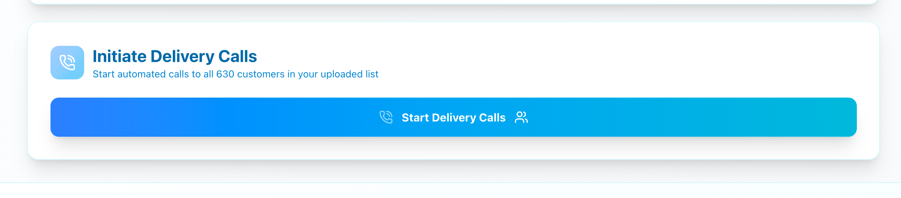
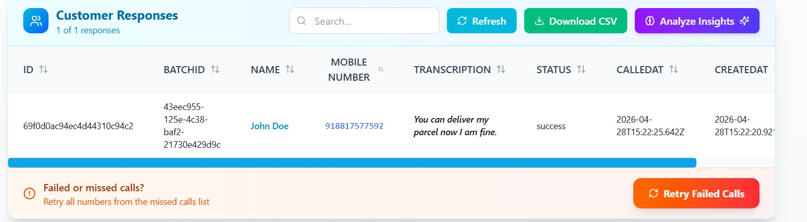

# 🧠 Pulse: Intelligent Operations for Dark Stores & Retail Supply Chains

**Event:** Google Solution Challenge 2026  
**Team Name:** DSA  

---

## 📚 Table of Contents
- [🚀 Project Overview](#-project-overview)
- [🏆 Problem Statement](#-problem-statement)
- [🏗️ Architecture & Process Flows](#️-architecture--process-flows)
- [💡 What Does Pulse Do?](#-what-does-pulse-do)
- [📈 Business Value & Cost](#-business-value--cost)
- [📦 Features](#-features)
- [🛠️ Tech Stack](#️-tech-stack)
- [⚙️ How It Works](#-how-it-works)
- [🔭 Future Development Roadmap](#-future-development-roadmap)
- [👥 Team & Credits](#-team--credits)

---

## 🚀 Project Overview
**Pulse** is an end-to-end AI solution designed for high-speed dark store environments where demand is volatile and delivery timelines are tight. It integrates smart inventory prediction with automated last-mile delivery communication to reduce wastage and manual workload.

Built for scale and real-world usability, Pulse uses **Hugging Face** for demand forecasting, **Gemini API** for intelligent insights, and **Twilio** for automated telephony.

---

## 🏆 Problem Statement
**Focus Track:** Smart Supply Chains Open Innovation

Retailers and dark stores face critical challenges:
- **Overstocking:** Wastage of perishable goods due to inaccurate planning  
- **Understocking:** Lost sales and poor customer experience  
- **Failed Deliveries:** Lack of proactive communication  
- **Manual Effort:** High operational overhead  

---

## 🏗️ Architecture & Process Flows

### 1. Technical Sequence Architecture

### 2. Core Process Flows
Pulse automates two primary pipelines: Stock Optimization and Last-Mile Delivery.

---

## 💡 What Does Pulse Do?

### 📊 Intelligent Stock Optimization

* Forecasts SKU-level demand using historical data
* Reduces stockouts and wastage
* Enables data-driven inventory planning

### 📞 Automated Delivery Coordination

* AI-powered voice calls to customers
* Confirms availability and delivery instructions
* Eliminates manual coordination

### 🤖 Response Capture & Retry

* Converts voice responses to structured data
* Stores delivery instructions for drivers
* Intelligent retry system for failed calls

---

## 📦 Features

* 📊 AI Demand Forecasting
* 📞 Automated Voice Call System
* 🔁 Smart Retry Logic
* 📈 Real-Time Dashboard
* 🧠 AI Insights & Recommendations
* 🔗 Scalable API Architecture

---

## 📈 Business Value & Cost

### Impact

* Higher delivery success rates
* Reduced stock wastage
* Lower operational workload

### Scalability

* Works with simple CSV uploads
* Suitable for multi-store operations

### Monthly Cost Estimate (1,000 Users)

| Component     | Technology                | Cost              |
| ------------- | ------------------------- | ----------------- |
| Communication | Twilio                    | ₹1,000 - ₹2,000   |
| AI Processing | Gemini                    | ₹200 - ₹500       |
| Cloud & DB    | Vercel + MongoDB + Render | ₹500 - ₹1,000     |
| **Total**     |                           | **₹1.7k - ₹3.5k** |

**Per User Cost:** ₹2 - ₹3.5/month

---

## 🛠️ Tech Stack

**Frontend:** React.js, Tailwind CSS, Vite
**Backend:** Node.js, Express
**AI/ML:** Hugging Face, Gemini, Scikit-learn, Pandas
**Communication:** Twilio API
**Database:** MongoDB
**Auth:** Google Auth
**Deployment:** Vercel, Render, GitHub

---

## ⚙️ How It Works

1. Upload sales or delivery CSV
2. Backend processes data
3. Hugging Face generates predictions
4. Gemini provides insights
5. Twilio handles customer calls
6. Results displayed on dashboard

---

## 🔭 Future Development Roadmap

* 🌍 Multilingual voice support
* 📱 WhatsApp, SMS, and app notifications
* 🧠 Advanced anomaly detection
* 🔗 ERP & logistics integrations

---

## 👥 Team & Credits

* Anuj Sahu
* Devraj Patil
* Saksham Gupta

---

## ⚠️ Disclaimer

This project is a hackathon prototype built for the Google Solution Challenge 2026.

---

**Pulse: Powering the future of retail supply chains with AI.**
