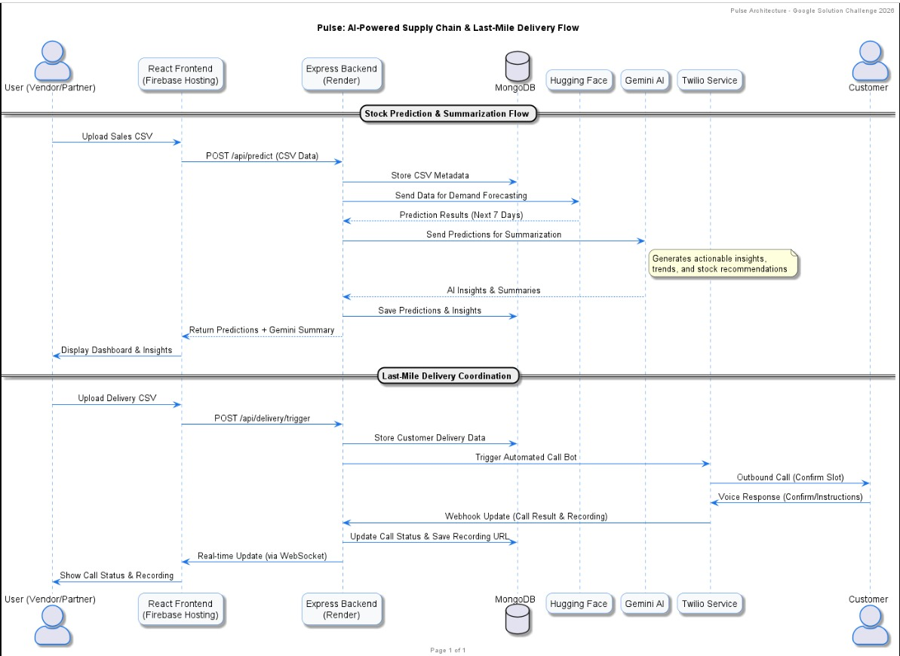
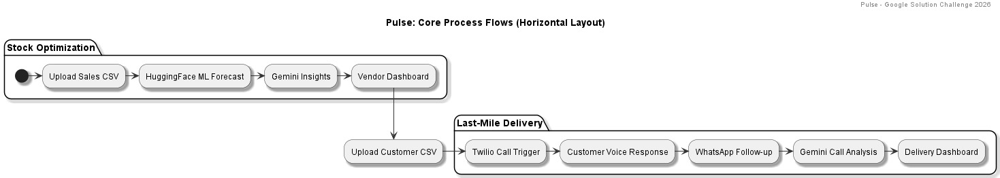
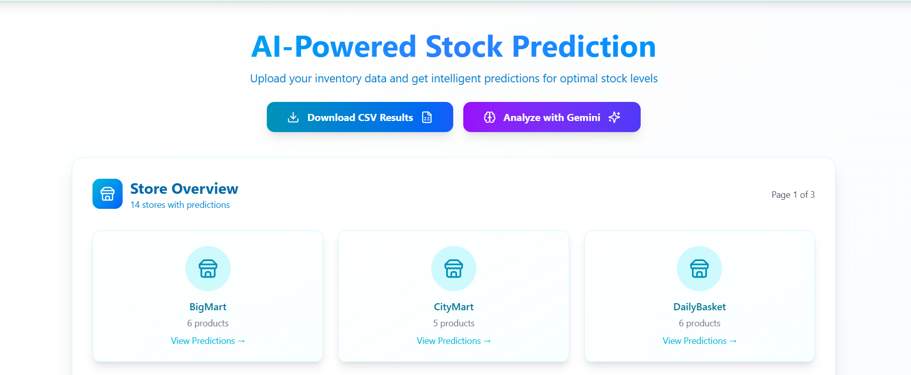
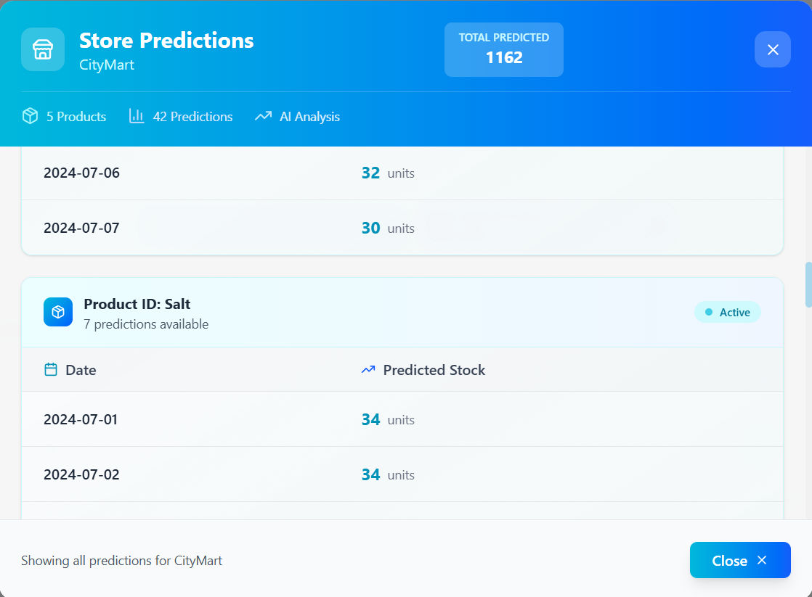
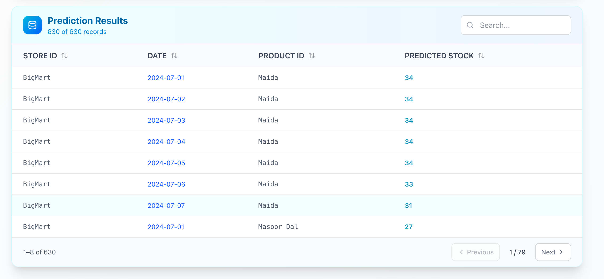
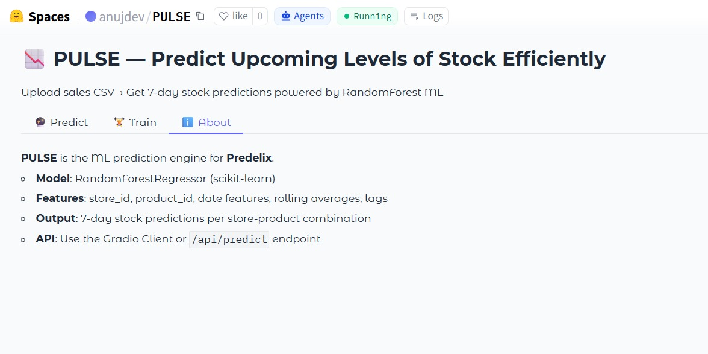
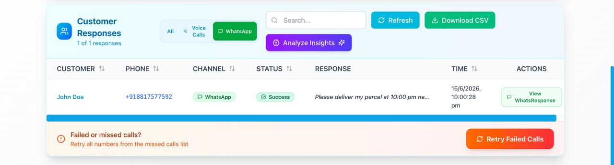
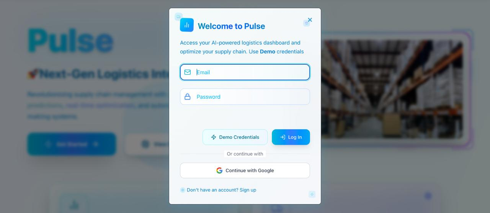

<div align="center">

# 🧠 Pulse: Intelligent Operations for Dark Stores & Retail Supply Chains

**Event:** Google Solution Challenge 2026
**Team Name:** DSA

[](https://developers.google.com/community/gdsc-solution-challenge)
[](https://ai.google.dev/)
[](https://developers.google.com/identity/protocols/oauth2)
[](https://huggingface.co/spaces/anujdev/PULSE)
[](https://cloud.google.com/)
[](https://render.com/)
[](https://www.mongodb.com/)

**Team DSA** &nbsp;·&nbsp; Anuj Sahu &nbsp;·&nbsp; Devraj Patil &nbsp;·&nbsp; Saksham Gupta

> *Powering the future of retail supply chains with AI.*

</div>

---

## 📚 Table of Contents

- [🚀 Project Overview](#-project-overview)
- [🏆 Problem Statement](#-problem-statement)
- [🏗️ Architecture & Process Flows](#%EF%B8%8F-architecture--process-flows)
- [💡 What Does Pulse Do?](#-what-does-pulse-do)
- [📦 Features](#-features)
- [📈 Business Value & Cost](#-business-value--cost)
- [🛠️ Tech Stack](#%EF%B8%8F-tech-stack)
- [📂 Project Structure](#-project-structure)
- [⚙️ How It Works](#%EF%B8%8F-how-it-works)
- [📡 API Reference](#-api-reference)
- [🚀 Getting Started](#-getting-started)
- [🔭 Future Roadmap](#-future-roadmap)
- [👥 Team](#-team)

---

## 🚀 Project Overview

**Pulse** is an end-to-end AI solution designed for high-speed dark store environments where demand is volatile and delivery timelines are tight. It integrates smart inventory prediction with automated last-mile delivery communication to reduce wastage and manual workload.

Built for scale and real-world usability, Pulse combines:
- 🤖 **Hugging Face** — SKU-level demand forecasting via a deployed ML model
- 🧠 **Google Gemini API** — conversational AI insights and anomaly detection
- 📞 **Twilio** — automated voice calls and WhatsApp delivery coordination

---

## 🏆 Problem Statement

> **Focus Track:** Smart Supply Chains — Open Innovation

Retailers and dark stores face critical operational challenges every day:

| Challenge | Impact |
|---|---|
| 📦 **Overstocking** | Wastage of perishable goods due to inaccurate demand planning |
| 🚫 **Understocking** | Lost revenue and poor customer experience |
| 🚚 **Failed Deliveries** | No proactive communication with customers |
| 🧑‍💼 **Manual Overhead** | High operational burden on store managers |

---

## 🏗️ Architecture & Process Flows

### 1. Technical Sequence Architecture


### 2. Core Process Flows
Pulse automates two primary pipelines: **Stock Optimization** and **Last-Mile Delivery**.



---

## 💡 What Does Pulse Do?

### 📊 Intelligent Stock Optimization

Pulse forecasts SKU-level demand for each store-product pair using historical sales data, enabling vendors to:

* Predict the next **7 days of stock requirements** per product
* Eliminate guesswork — switch to **data-driven inventory planning**
* Reduce both stockouts and perishable wastage





---

### 🤖 Deployed ML Forecasting Model

The core forecasting engine is a **Supervised Random Forest Regressor** deployed as a live Gradio Space on Hugging Face.

🔗 **Live Space:** [anujdev/PULSE](https://huggingface.co/spaces/anujdev/PULSE)

| Detail | Specification |
|---|---|
| **Algorithm** | `RandomForestRegressor(n_estimators=100, max_depth=10, n_jobs=-1)` |
| **Validation** | 80/20 train-test split with $R^2$, MSE, and MAE tracking |
| **Feature: Temporal Vectors** | Date ordinal, day-of-week, month — captures cyclic seasonality |
| **Feature: Sequential Lags** | `lag_1d` — tracks immediate preceding day's sales for demand shocks |
| **Feature: Rolling Context** | `rolling_avg_7d` per store-product pair — smooths noise, captures weekly trends |
| **Interface** | RESTful endpoints for on-the-fly training and 7-day predictive inference |



---

### 🧠 AI-Powered Insights & Recommendations

Pulse doesn't just show data — it interprets it. Powered by **Google Gemini**, the insights engine:

* 🔍 **Trend Detection** — automatically surfaces sales patterns and seasonal shifts
* ⚠️ **Anomaly Flagging** — highlights unusual demand spikes or drops
* 📋 **Restock Recommendations** — suggests what to reorder and when
* 💬 **Conversational AI Chat** — ask natural language questions about your store's metrics in real time


---

### 📞 SmartDrop — Automated Delivery Coordination

**SmartDrop** is Pulse's delivery intelligence module. It automates the entire customer communication pipeline for last-mile delivery:

* 📲 **Automated Voice Calls** — AI voice prompts via Twilio TwiML to confirm delivery slots and capture instructions
* 💬 **WhatsApp Notification Engine** — sends delivery updates directly to customers over WhatsApp and captures their real-time replies
* 🔁 **Smart Retry System** — failed calls are automatically queued; one-click retry from the dashboard
* 📊 **Unified Control Panel** — centralized triggers for calls, WhatsApp sends, and status tracking


---

### 🤖 Response Capture & Feedback Integration

Every customer interaction is captured and structured:

* Customer voice responses are transcribed and logged as delivery instructions for drivers
* Incoming WhatsApp replies are displayed live within the vendor dashboard
* Prediction accuracy feedback loop — vendors can mark forecasts as accurate or inaccurate to improve the model over time



---

### 🔐 Secure Authentication & Google OAuth

* Email/password accounts secured with **JWT** tokens
* One-click **Google OAuth 2.0** for frictionless onboarding
* Role-based access for vendors and delivery partners



---

## 📦 Features

| Feature | Description |
|---|---|
| 📊 **AI Demand Forecasting** | 7-day SKU-level predictions via deployed Hugging Face model |
| 💬 **WhatsApp Delivery Updates** | Real-time WhatsApp messaging and response capture via Twilio |
| 📞 **Automated Voice Calls** | TwiML-powered voice bots for delivery confirmation |
| 🔁 **Smart Retry Logic** | Auto-queue and one-click retry for failed delivery calls |
| 🧠 **Gemini AI Insights** | Trend detection, anomaly alerts, and restock recommendations |
| 💬 **Conversational AI Chat** | Ask questions about your store metrics in plain language |
| 🔌 **Real-time WebSocket Updates** | Live dashboard refresh via WebSocket events |
| 🔐 **Secure Auth** | JWT authentication + Google OAuth 2.0 |
| 📈 **Prediction Feedback Loop** | Vendor feedback on forecasts to improve model accuracy |
| 💻 **Responsive Dashboard** | Modern React + Tailwind frontend for vendors and delivery partners |

---

## 📈 Business Value & Cost

### Impact

| Metric | Outcome |
|---|---|
| 🚚 Delivery Success Rate | Higher — proactive customer communication via call + WhatsApp |
| 📦 Stock Wastage | Lower — AI forecasting reduces over/under ordering |
| 🧑‍💼 Operational Workload | Reduced — automated calls, messages, and retry handling |
| 📊 Inventory Accuracy | Improved — vendor feedback loop continuously refines predictions |

### Scalability

* Works with simple **CSV uploads** — no complex ERP integration required
* Suitable for **multi-store** operations with store-level prediction granularity

### Monthly Cost Estimate (1,000 Users)

| Component | Technology | Monthly Cost |
|---|---|---|
| Communication | Twilio (Voice + WhatsApp) | ₹1,000 – ₹2,000 |
| AI Processing | Google Gemini API | ₹200 – ₹500 |
| Cloud & DB | Vercel + MongoDB Atlas + Render | ₹500 – ₹1,000 |
| **Total** | | **₹1,700 – ₹3,500** |

> **Per-user cost: ₹2 – ₹3.5/month**

---

## 🛠️ Tech Stack

| Layer | Technology |
|---|---|
| **Frontend** | React 18, Tailwind CSS, Vite |
| **Backend API** | Node.js, Express.js (deployed on Render) |
| **ML / Forecasting** | Hugging Face Spaces, Scikit-learn, Pandas, Gradio |
| **Voice & WhatsApp Bot** | Twilio (TwiML, WhatsApp API) |
| **AI Insights & Chat** | Google Gemini API |
| **Database** | MongoDB Atlas |
| **Authentication** | JWT + Google OAuth 2.0 |
| **Real-time** | WebSocket (ws) |
| **Deployment** | Render (backend), Vercel (frontend), Hugging Face (ML model) |

---

## 📂 Project Structure

```text
Pulse/
├── client-side/                    # React Dashboard (Vite + Tailwind)
│   └── src/
│       ├── components/             # Shared UI components
│       ├── context/                # React context providers (Auth, Loading, Demo)
│       ├── hooks/                  # Custom React hooks
│       ├── pages/
│       │   ├── Home.jsx            # Landing page
│       │   ├── Predict.jsx         # Stock forecasting dashboard
│       │   ├── SmartDrop.jsx       # Delivery coordination dashboard
│       │   └── About.jsx
│       ├── router/                 # AppRouter with protected routes
│       └── services/               # API service layer
│           ├── auth.service.js         (Authentication)
│           ├── prediction.service.js   (Hugging Face forecasting)
│           ├── delivery.service.js     (Twilio calls & WhatsApp)
│           ├── insights.service.js     (Gemini AI insights)
│           ├── feedback.service.js     (Prediction feedback loop)
│           ├── data.service.js         (Data management)
│           └── realtime.service.js     (WebSocket)
│
├── backend/                        # Express API (Render)
│   ├── src/
│   │   ├── config/                 # Service configurations
│   │   ├── routes/                 # Express route definitions
│   │   ├── controllers/            # Request handlers
│   │   ├── services/               # Business logic layer
│   │   ├── middleware/             # Auth, CORS, error handling
│   │   ├── models/                 # MongoDB data models
│   │   └── utils/                  # Logger and helpers
│   └── Dockerfile
│
└── pulse-space/                    # Hugging Face Model Deployment
    ├── app.py                      # Gradio Interface & inference logic
    └── requirements.txt
```

---

## ⚙️ How It Works

### 🧮 Stock Prediction Workflow

```
Vendor uploads CSV  →  Backend → Hugging Face model
                                        ↓
                         7-day per-SKU demand forecast
                                        ↓
                         Dashboard displays predictions
                                        ↓
                     Gemini API generates insights & alerts
                                        ↓
                     Vendor submits accuracy feedback → model improves
```

1. Vendor uploads a sales history CSV via the React dashboard
2. Backend forwards data to the Hugging Face Space for inference
3. Model returns a 7-day demand forecast per store-product combination
4. Results are displayed on the interactive prediction dashboard
5. Gemini API automatically generates trend insights and restock recommendations
6. Vendor feedback on forecast accuracy is captured for continuous improvement

### 📞 SmartDrop Delivery Workflow

```
Delivery partner uploads customer CSV
              ↓
     Backend stores customer data
              ↓
   Twilio triggers automated voice calls  +  WhatsApp messages
              ↓
 Customer responds (voice recorded / WhatsApp reply captured)
              ↓
   Dashboard shows live status, responses, and recordings
              ↓
      Failed calls queued → one-click Retry
```

1. Delivery partner uploads a customer CSV via the SmartDrop dashboard
2. Backend stores records and triggers both Twilio voice calls and WhatsApp messages
3. Twilio delivers AI voice prompts (TwiML) and WhatsApp updates simultaneously
4. Customer voice responses are recorded; WhatsApp replies are captured via webhook
5. All statuses, recordings, and replies appear live on the dashboard
6. Failed calls are automatically queued for retry

---

## 📡 API Reference

### Authentication · `/api/auth`

| Method | Endpoint | Description |
|---|---|---|
| `POST` | `/register` | Register a new vendor or delivery partner |
| `POST` | `/login` | Email/password login |
| `POST` | `/google` | Google OAuth 2.0 login |
| `POST` | `/refresh` | Refresh JWT access token |
| `POST` | `/logout` | Logout and invalidate session |
| `GET` | `/me` | Get currently authenticated user |
| `PUT` | `/role` | Update user role (vendor / delivery partner) |

### Predictions · `/api/predict`

| Method | Endpoint | Description |
|---|---|---|
| `POST` | `/` | Upload sales CSV and get 7-day forecasts |
| `POST` | `/train` | Submit retraining job to Hugging Face |
| `GET` | `/results` | Fetch latest prediction results |
| `GET` | `/summary` | Get dashboard summary stats |

### Delivery & WhatsApp · `/api/delivery`

| Method | Endpoint | Description |
|---|---|---|
| `POST` | `/upload` | Upload customer delivery CSV |
| `POST` | `/trigger` | Trigger automated voice calls |
| `POST` | `/whatsapp/send` | Send WhatsApp delivery updates |
| `GET` | `/results` | Fetch call statuses and recordings |
| `GET` | `/status` | Get batch delivery status |
| `POST` | `/retry` | Retry failed calls |
| `ALL` | `/voice/:recordId` | Twilio voice webhook |
| `ALL` | `/recording/:recordId` | Twilio recording webhook |
| `ALL` | `/whatsapp` | Twilio WhatsApp inbound webhook |
| `ALL` | `/whatsapp/:recordId` | Twilio WhatsApp webhook (per record) |

### AI Insights · `/api/insights`

| Method | Endpoint | Description |
|---|---|---|
| `POST` | `/sales` | Generate Gemini AI sales insights |
| `POST` | `/delivery` | Generate Gemini AI delivery insights |
| `GET` | `/store/:storeId` | Get store performance summary |
| `POST` | `/chat` | Conversational AI assistant |

---

## 🚀 Getting Started

### Prerequisites
- Node.js 18+
- MongoDB connection string
- Gemini API key
- Hugging Face project/endpoint
- Google OAuth client ID
- Twilio account with verified phone number

### Backend Setup:
```bash
cd backend
cp .env.example .env  # Configure your credentials
npm install
npm run dev
```

### Frontend Setup:
```bash
cd client-side
npm install
npm run dev
```

---

## 🔭 Future Roadmap

| Feature | Description |
|---|---|
| 🌍 **Multilingual Voice** | Voice prompts in regional Indian languages |
| 📱 **SMS Notifications** | Fallback SMS for customers without WhatsApp |
| 🧠 **Advanced Anomaly Detection** | Proactive alerts for unusual sales patterns |
| 🔗 **ERP & Logistics Integrations** | Connect with Shopify, SAP, or third-party logistics APIs |

---

## 👥 Team & Credits

<div align="center">

**Anuj Sahu** &nbsp;·&nbsp; **Devraj Patil** &nbsp;·&nbsp; **Saksham Gupta**

</div>

---

## ⚠️ Disclaimer

This project is a hackathon prototype built for the **Google Solution Challenge 2026**.

---

<div align="center">

**Pulse — Intelligent Operations for Dark Stores & Retail Supply Chains**

[](https://developers.google.com/community/gdsc-solution-challenge)

</div>
